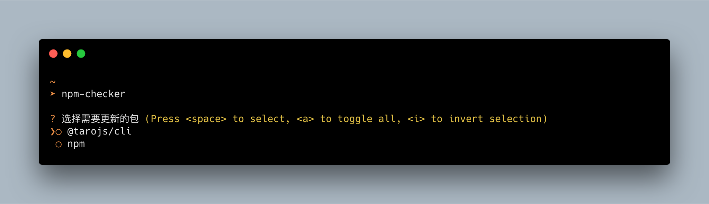

# global-npm-checker

从自用工具分离

我知道有 `npm-check`，但它太强大了，我只需要用来检查哪些工具需要更新并直接更新即可

同类轮子过多所以不上 npm，自行 `npm link`

可能会有简单更新

It separate by my own development kit

I Know `npm-check` but it's too strong for me, maybe I would like to get outdated packages in my global installed.

This package will not in npm.
